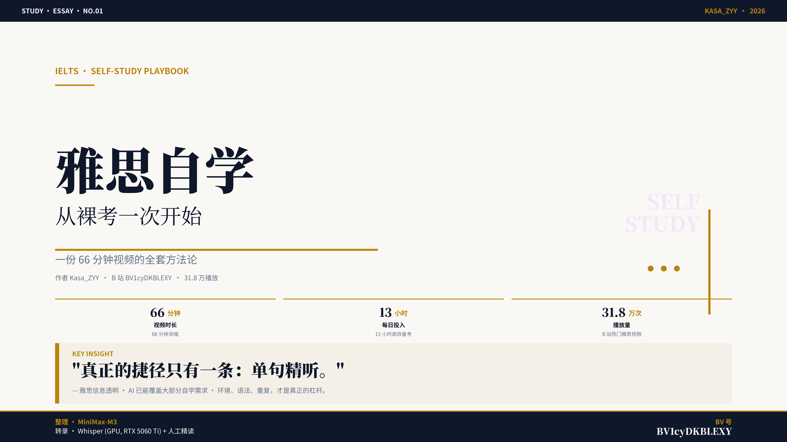

# bili_summary · 视频一键总结

> 把任意 B 站视频变成 **编辑级 PDF / Word 总结文档**。
> 一条 URL → 抓取 → Whisper 转录 → LLM 结构化总结 → 封面 / 信息图 → 导出。
> Web UI 与 CLI 双入口，开箱即用。



---

## ✨ 特性

| 能力 | 实现 |
|------|------|
| 🎙 **本地 Whisper 转录** | small 模型 + CUDA FP16，RTX 5060 Ti 实测 18× 实时 |
| 🤖 **LLM 结构化总结** | 任意 OpenAI 兼容端点（默认 deepseek-v4-flash / gpt-4o-mini） |
| 🧠 **Map/Reduce 摘要** | 转录超 24K token 自动分段 → 二次合并 |
| 🎨 **编辑级封面 / 信息图** | PIL + Noto Serif/Sans SC · 6000×3375 高清 PNG |
| 📄 **PDF + DOCX 双导出** | reportlab + python-docx · 完整章节、金句、时间戳索引 |
| 🌐 **Web UI** | Streamlit · 实时进度条 + 一键取消 + 文件预览与下载 |
| 💾 **智能缓存** | 元数据 / 音频 / 转录 / LLM 总结 全流程可复用 |
| ⚙️ **跨平台字体** | Windows / macOS / Linux 自动 fallback Noto Serif/Sans SC |

---

## 🚀 快速开始

### 前置依赖

- Python ≥ 3.11
- CUDA GPU（推荐，CPU 也可跑但慢）
- ffmpeg（pip 自动装 `imageio-ffmpeg`）
- 系统字体 **Noto Serif SC** / **Noto Sans SC**
- B 站 **SESSDATA** cookie（仅下载必需，元数据抓取/总结不依赖）

### 安装

```bash
git clone https://github.com/<your-name>/bili_summary.git
cd bili_summary
pip install -r requirements.txt
```

### 配置

```bash
cp llm_config.example.json llm_config.json
# 编辑 llm_config.json，填入 base_url / api_key / model
```

或用环境变量（优先级更高）：

```powershell
$env:OPENCODE_BASE_URL = "https://api.opencode.ai/v1"
$env:OPENCODE_API_KEY  = "<your key>"
$env:LLM_MODEL         = "deepseek-v4-flash"
```

### 启动 Web UI

```bash
streamlit run app.py
# Windows: run_ui.bat
# Mac/Linux: ./run_ui.sh
```

浏览器访问 <http://localhost:8501> → 粘贴 B 站视频 URL → 点 **🚀 开始生成**。

### 命令行

```bash
python src/run_pipeline_cli.py "https://www.bilibili.com/video/BVxxxxxxxxxx" \
    --out output
```

进度以 JSON line 写到 stdout，最终 `summary.pdf` / `summary.docx` 在 `output/`。

---

## 🤖 LLM 协议选择

`bili_summary` 通过 `protocol` 字段支持两种主流 LLM 调用协议，按需切换：

| 协议 | 端点 | 适用场景 | 鉴权头 |
|------|------|---------|--------|
| `openai` *(默认)* | `{base_url}/v1/chat/completions` | OpenAI 官方 / OpenAI 兼容代理（opencode、DeepSeek、OpenRouter 等） | `Authorization: Bearer ...` |
| `anthropic` | `{base_url}/v1/messages` | Claude 原生端点 / 同时提供 Anthropic 协议的代理 | `x-api-key: ...` + `anthropic-version` |

### 切换方式

**方式 1 · llm_config.json**

```json
{
    "protocol": "anthropic",
    "base_url": "https://api.anthropic.com",
    "api_key":  "sk-ant-your-key",
    "model":    "claude-3-5-sonnet-20241022"
}
```

**方式 2 · 环境变量**（优先级更高）

```powershell
$env:LLM_PROTOCOL = "anthropic"
$env:OPENCODE_BASE_URL = "https://api.anthropic.com"
$env:OPENCODE_API_KEY  = "sk-ant-your-key"
$env:LLM_MODEL         = "claude-3-5-sonnet-20241022"
```

### 协议差异提醒

- **OpenAI 协议** 支持 `response_format: {type: json_object}`，结构化输出更稳。
- **Anthropic 协议** 不支持 JSON-mode，依赖 prompt 强约束；代码已自动分离 `system` 到顶层字段。
- 切换协议**无需重启已运行的 pipeline**，但需重启 Streamlit 进程以让新 env 生效。

---

```bash
python src/run_pipeline_cli.py "https://www.bilibili.com/video/BVxxxxxxxxxx" \
    --out output
```

进度以 JSON line 写到 stdout，最终 `summary.pdf` / `summary.docx` 在 `output/`。

---

## 🏗 架构

```
URL ──► fetch meta ──► download audio ──► Whisper ──► LLM summarize
                          │                                   │
                          ▼                                   ▼
                       cache                              build layout
                                                              │
                          ┌───────────────────────────────────┼──────────────────────┐
                          ▼                                   ▼                      ▼
                    make_cover.png                    make_infographic.png     render_pdf + render_docx
```

模块说明：

| 模块 | 职责 |
|------|------|
| [src/pipeline.py](src/pipeline.py) | 编排 5 步流水线 + 缓存判定 + 进度回调 |
| [src/download_bili_audio.py](src/download_bili_audio.py) | B 站 `/x/web-interface/view` + 传统 `/x/player/playurl` 绕过 wbi 风控 |
| [src/llm_client.py](src/llm_client.py) | OpenAI 兼容调用 + tiktoken 计数 + map/reduce 分段 + JSON-mode 容错 |
| [src/make_cover.py](src/make_cover.py) / [src/make_infographic.py](src/make_infographic.py) | PIL 高清 PNG 渲染 |
| [src/render_pdf.py](src/render_pdf.py) / [src/render_docx.py](src/render_docx.py) | reportlab / python-docx 文档导出 |
| [src/design_tokens.py](src/design_tokens.py) | 跨渲染器共享色值 + 字体路径 fallback |

更深入的架构与扩展计划见 [`docs/`](docs/)。

---

## 🎨 设计系统

| Token | 值 | 用途 |
|-------|----|----|
| **Ink** | `#0F172A` | 标题、正文 |
| **Gold** | `#B8860B` | 强调、数字、eyebrow |
| **Paper** | `#FAF8F5` | 暖白纸背景 |
| **Slate** | `#64748B` | 副文 |
| **Border** | `#E8E2D5` | 卡片、表格边线 |
| **Muted BG** | `#F4F0E8` | 信息块底色 |

字体：

- 中文标题：**Noto Serif SC** Black weight
- 中文正文：**Noto Sans SC** Regular / Bold
- 装饰英文：Noto Serif SC Italic + 薰衣草 `#EFE7FC`

详见 [docs/design-system.md](docs/design-system.md)。

---

## 🔒 安全与隐私

> ⚠️ **本项目运行时会下载 B 站视频并调用第三方 LLM**。请遵守相关平台的服务条款与版权规定，**仅用于个人学习与研究**。

**绝不要提交的内容**（已在 `.gitignore` 中排除）：

| 文件 | 原因 |
|------|------|
| `llm_config.json` | 含 LLM API key |
| `.bili_cookie` / `.bili_cookies.txt` | B 站登录态 cookie，等同账号密码 |
| `.history/` | IDE 历史快照，可能含旧 key |
| `.streamlit/` | Streamlit 本地配置 |
| `output/` | 整目录——含 mp3/mp4/总结文档，单视频可上百 MB |
| `*.mp3` / `*.mp4` | 下载的媒体文件（版权 + 体积） |
| `__pycache__/` / `.venv/` | 编译/虚拟环境产物 |

**推荐工作流**：

1. Fork 本仓库 → 改远端为私有 → 你的本地工作树
2. 通过 `llm_config.example.json` 提示其他用户**如何**配置，但不暴露你的 key
3. 公开仓库**永远不要** force-push 含 key 的 commit——若已发生，立刻 revoke key

---

## ⚠️ 已知限制

| 项 | 说明 |
|----|------|
| **B 站音频** | 仅最小音质（qn=80），绕过 wbi 风控；高级画质需登录态 |
| **Whisper 模型** | 首次运行下载 ~500 MB，后续本地缓存 |
| **GPU 推荐** | CPU 模式约 0.3× 实时，1 小时视频需 ~3 小时 |
| **PDF 中文字体** | reportlab 默认 `STSong-Light`（macOS/Linux 可改为 Noto Serif SC） |
| **平台支持** | 仅 B 站完整实现；YouTube/X/Vimeo 仅 URL 解析，无原生 fetcher（见 [roadmap](docs/roadmap-multi-platform.md)） |
| **LLM 兼容性** | 同时支持 OpenAI 兼容 `/v1/chat/completions` 与 Anthropic 原生 `/v1/messages`，通过 `protocol` 字段切换（详见上方） |

---

## 📜 License

MIT — 自由使用、修改、商用。详见 [LICENSE](LICENSE)。

---

## 🙏 致谢

- [openai/whisper](https://github.com/openai/whisper) — 本地语音转录
- [yt-dlp](https://github.com/yt-dlp/yt-dlp) — 视频下载生态
- [reportlab](https://www.reportlab.com/) / [python-docx](https://python-docx.readthedocs.io/) — 文档生成
- [Pillow](https://pillow.readthedocs.io/) — 图像渲染
- [Streamlit](https://streamlit.io/) — Web UI 框架

> 早期本地开发环境曾以 `MiniMax-M3` 作为 git 身份标识（沿用至今的所有 commit
> 均由 [@cang-ge](https://github.com/cang-ge) 独立完成），故 GitHub 仓库页面会
> 显示 "cang-ge and MiniMax-M3" 的合作者标记。